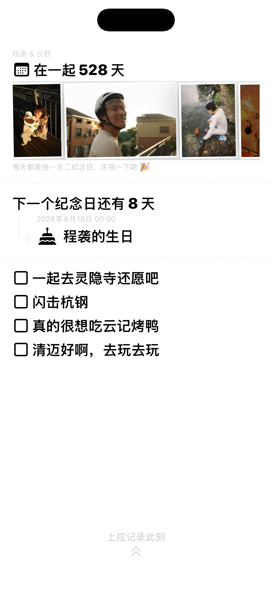
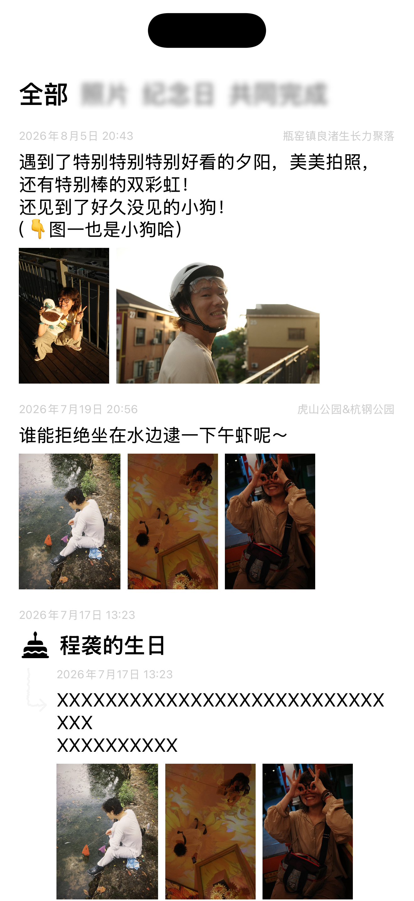
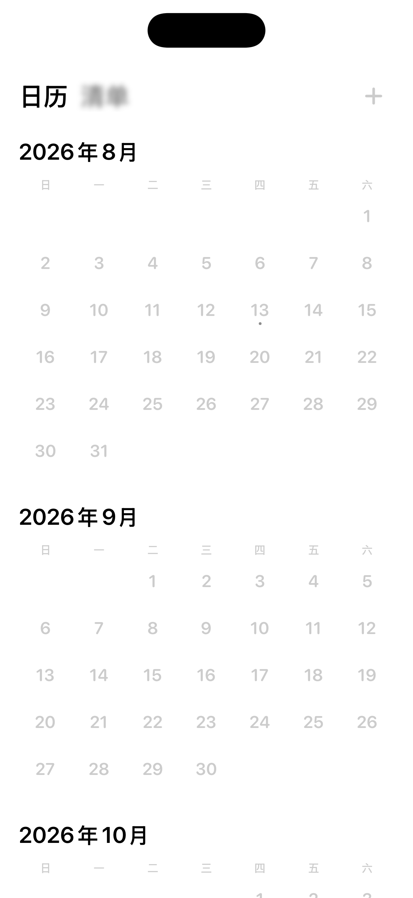

# oursince for iOS

一款只属于两个人的原生 iOS 共同记录应用。界面依据 [Figma 设计稿](https://www.figma.com/design/jtLq9nC41D1hpaLmWRM0Et/) 实现，并接入 [CoupleServer](https://github.com/Rabithua/CoupleServer) 的线上 API。



## 已实现

- 系统 Passkey 注册与登录，凭证写入 Keychain，Access Token 失效时自动刷新
- 创建共同空间、生成/分享邀请码、接受邀请，以及关系日期设置
- “过去 / 现在 / 未来”三页横向手势导航
- 全部、照片、纪念日、共同完成四种回忆筛选
- 照片选择、当前位置采集、预签名直传、附件 finalize、文字与关联记录发布
- 共同清单创建、完成状态切换与即时反馈
- 纪念日、日程创建及 12 个月日历浏览
- 下一个纪念日、在一起天数、近期照片和共同清单首页聚合
- 下拉刷新、加载/错误状态、预览数据模式和辅助功能标识

## 技术栈

- Swift 6、SwiftUI、Observation
- AuthenticationServices / Passkey
- URLSession + Codable
- Keychain Services
- PhotosUI
- XcodeGen（项目文件也已提交，可直接打开）

最低系统版本为 iOS 17，应用 Bundle ID 为 `com.oursince.couple`。默认 API 地址：

```text
https://oursince.com/v1/api
```

## 本地运行

直接用 Xcode 打开 `Couple.xcodeproj`，选择一个 iPhone 模拟器运行即可。若修改了 `project.yml`，先重新生成工程：

```bash
brew install xcodegen
xcodegen generate
```

首次打开可点“预览设计与交互”，或在 Scheme 的启动参数中加入：

```text
-ui-testing-demo
```

## 测试

```bash
xcodebuild \
  -project Couple.xcodeproj \
  -scheme Couple \
  -destination 'platform=iOS Simulator,name=iPhone 17 Pro Max' \
  -derivedDataPath DerivedData \
  CODE_SIGNING_ALLOWED=NO \
  test
```

测试覆盖 Base64URL、服务端 envelope / ISO 8601 解码、月历网格、预览数据装载，以及“过去 → 现在 → 未来 → 记录表单”的 UI 旅程。

## Passkey 上线前配置

iOS Target 已包含：

```text
webcredentials:oursince.com
```

正式设备上的 Passkey 还要求 API 域名通过 HTTPS 返回 Apple App Site Association 文件：

```json
{
  "webcredentials": {
    "apps": ["SSK4KVR5FN.com.oursince.couple"]
  }
}
```

路径必须是 `/.well-known/apple-app-site-association`，响应不能重定向，并应使用 `application/json`。应用须使用 Team `SSK4KVR5FN` 完成签名。

## 设计截图

| 过去 | 现在 | 未来 |
| --- | --- | --- |
|  |  |  |
